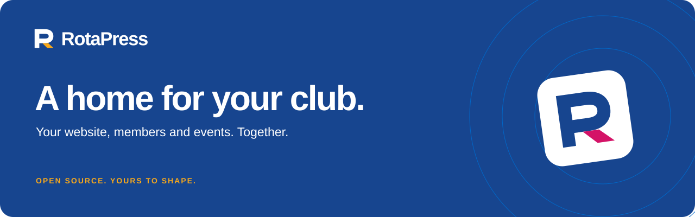

[Host your club](#host-your-club) · [Run locally](#run-locally) · [Documentation](docs/README.md) · [Contribute](CONTRIBUTING.md) · [Brand assets](docs/guides/rotapress-brand.md)

An open-source home for Rotary, Rotaract and other community organizations.
Build your website, welcome members, collect responses and organize events
from one application. One installation, your club, your identity.

**Status: pre-release, under active development.** Portable Docker hosting includes
automatic database setup and migrations. Review the
[roadmap and limitations](docs/development/roadmap.md) before production use.

## What you can do

- **Build your website:** visual page editing, editable Rotary and Rotaract
  templates, shared headers and menus, language variants, private drafts and
  deliberate publication.
- **Manage your community:** membership applications, approval, scoped staff
  permissions, a private member portal and a published community directory.
- **Collect responses:** reusable forms, conditional questions, multi-page forms,
  private responses, CSV exports and queued notifications.
- **Organize events:** event pages, teams, native free registration, packages,
  guest access and prize showcases. Draw tools are demonstrations only.
- **Maintain calendars:** recurring activities, public/member audiences, calendar
  imports, subscriptions and reminders.
- **Connect services:** optional Google sign-in, Luma, SMTP and Resend integrations.
  Configure the initial email sender before the first owner signs in.
- **Work with AI:** independently enable REST API or MCP in Integrations. Scoped
  connections can prepare private pages, events and images, inspect native page
  previews, and leave event settings for staff approval. Separate grants let an
  assistant publish specific saved content when you explicitly request it.

External integrations require provider configuration and verification on your
installation. Native paid checkout, check-in and production draw activation are
not supported. Domain records in administration do not provision hosting or DNS;
the standalone hosting installer supplies HTTPS for a domain pointing at its server.

## Host your club

On a Linux server with Docker Compose and Node.js 24, point your domain to the
server, clone this repository and run:

```sh
node scripts/host.mjs
```

Enter your domain, owner email and verified email sender. The assistant prepares
PostgreSQL, security keys, persistent uploads, HTTPS and background tasks. Open
your private setup link, verify your email and introduce your club. No database
commands or manual migrations are needed. The sender appears in Integrations
after setup, with credentials hidden.

Use the same Docker application on your preferred VPS, your own server or a
compatible container platform. Updates back up first and run new migrations
automatically. See the [hosting guide](docs/guides/hosting.md) for requirements,
provider differences, updates and recovery. Hosting accounts, DNS and actual
deployment remain under your control.

## Run locally

You need Git, Node.js 24 and Docker with Compose. On Windows, use Docker Desktop's
Linux container engine. Installation downloads pinned pnpm and Node runtimes
inside the project; it does not replace system-wide installations.

```sh
git clone https://github.com/Rotaract-Luxembourg-ASBL/RotaPress.git
cd RotaPress
node scripts/pnpm.mjs install
node scripts/pnpm.mjs setup
```

If you already have a checkout, start with the install command. Use the wrapper
shown above: plain `pnpm setup` is pnpm's own command, not this project's setup.

1. Configure **Resend or SMTP in the server environment** using the
   [first-run email guide](docs/guides/email-setup.md). Owner verification needs
   this sender before admin exists. Keep credentials private in `.env.local`.
2. Nominate an inbox you control and start the app:

   ```sh
   node scripts/pnpm.mjs setup --owner-email your-real-address@example.org
   node scripts/pnpm.mjs dev
   ```

3. Open [owner setup](http://127.0.0.1:3000/setup), request a verification code and
   read it in your inbox. Verify the code, enter your club details and paste the
   private one-hour claim from `.local/setup-claim.txt`.
4. Complete your club identity, choose a Rotary, Rotaract or blank website, and
   review your choices. The selected template and theme are installed as private
   drafts. In [administration](http://127.0.0.1:3000/admin), review your content
   before publishing; **Website → Templates** can change the selection later.

Setup guides you through email readiness, owner verification and club details.
No demo members or events are created. Admin Email settings can replace the
server sender afterward. If the claim expires, rerun setup with the same owner.
For contributor work without a real sender, use the separate
[development instructions](docs/development/local-development.md#development-email-only).

Setup creates separate development and test databases, local secrets and protected
owner setup. It preserves existing data and cannot claim an installed club again.
The website defaults to `http://127.0.0.1:3000`; all local services bind to loopback.
See [local development](docs/development/local-development.md) for configuration,
alternative ports, stopping services and owner recovery.

## Verify a change

After local setup, install the test browser once and run the checks:

```sh
node scripts/pnpm.mjs browser:install
node scripts/pnpm.mjs verify
node scripts/pnpm.mjs doctor
```

Verification runs the 800-line file guard, strict TypeScript, lint, focused tests
against PostgreSQL, a production build and two principal Chromium journeys.
Tests use a dedicated disposable database, separate from your development data.
Synthetic tests do not establish live integration support or real inbox delivery.
See [testing](docs/development/testing.md) for focused commands.

## Documentation

- [Documentation index](docs/README.md): website, members, forms, events and integrations.
- [Local development](docs/development/local-development.md): installation and everyday operation.
- [Architecture](docs/development/architecture.md): code layout, security and extension boundaries.
- [Roadmap](docs/development/roadmap.md): remaining work and current limitations.
- [Contributing](CONTRIBUTING.md): development practices and pull requests.
- [Code of conduct](CODE_OF_CONDUCT.md) and [security reporting](SECURITY.md).

## Built with

One Next.js App Router application using TypeScript, PostgreSQL 17, Drizzle with
the `pg` driver, Better Auth and Puck. Local files store uploads; PostgreSQL stores
durable jobs; a separate optional service captures synthetic development email. Exact versions live in
[package.json](package.json), [pnpm-lock.yaml](pnpm-lock.yaml) and
[compose.yaml](compose.yaml).

## License

RotaPress code and project documentation use the [MIT license](LICENSE), copyright
Rotaract Luxembourg ASBL. Bundled photographs and Rotary/Rotaract marks have
separate terms: see [asset notices](public/templates/BRAND_ASSETS.md) and
[photograph credits](docs/guides/website-kits.md#images-and-identity). The code
license does not grant trademark rights or imply endorsement.
