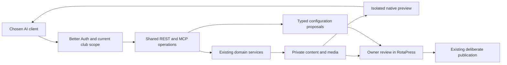

# AI-assisted website and event workflows

The intended workflow is: connect a chosen assistant, describe the website or
event, let it prepare native drafts and private media, inspect real previews, and
review the result in RotaPress. The assistant runs in its client; RotaPress does
not run a model, store model-provider keys or add a separate agent service.

## Delivery phases and acceptance

| Phase | Result | Required acceptance |
| --- | --- | --- |
| 1. Shared contract | Discover native blocks, layouts, templates, feature availability and task prompts through REST and MCP | One registry, valid examples and closed outputs; feature changes fail the contract check until reviewed |
| 2. OAuth connection | Register an exact client, sign in, review scopes/source websites, connect and revoke | Better Auth token ownership; authorization-code + PKCE S256; exact redirects/resource; expiry, replay and revocation; real local OTP journey |
| 3. Media | Upload an image, inspect allowed pixels, add private metadata and reuse its ID in a page | Decode/size/type/pixel limits, private by default, explicit pixel scope, safe retries, no URL-fetch bypass or visibility mutation |
| 4. Visual review | Capture a saved page at desktop/phone sizes, review overflow and inspect subsequent image slices | Same CMS renderer, exact revision, private authorized assets, no scripts or external network, bounded rendering, reauthorization before returning pixels |
| 5. Event preparation | Create a complete private starting event, edit its pages/forms/packages/prizes, identify readiness blockers and propose operational configuration for staff review | Existing services and event scope; no participant copies, activation or publication hidden in content writes; optimistic versions and private review links |
| 6. Integration assurance | Documentation, tester, client prompts and application checks agree | Focused regressions, real PostgreSQL, both principal browser journeys, build/types/lint, dependency audit and final contract receipt |

Implementation must complete each affected vertical workflow rather than expose
unconnected endpoints. Local acceptance and actual ChatGPT/provider acceptance
are separate: the latter requires a reachable configured host and the owner's
chosen account. Local work does not authorize deployment or a public tunnel.

## Authority and publication

The server grants capabilities, not the prompt. Reload current identity,
membership, Google session policy, organization and object scope. OAuth consent
and manually issued connection keys delegate a real staff session; they cannot
create membership, change staff permissions or authorize actions after revocation.

Separate metadata from image pixels, read from draft write, and draft preparation
from operational activation. Selecting an extra scope requires an explicit owner
choice; discovery describes only the connection's granted operations. No image
becomes public merely because AI selected it. No page, form or event becomes
public merely because a tool finished successfully.

Keep consequential settings as typed review proposals where the underlying
feature has no draft model. Only the authenticated administration workflow may
apply a proposal, after current authorization and expected-state checks. A model's
`confirmed: true`, a prompt, or an MCP annotation is never human approval. Current
publication controls remain the authority for publishing content.

Participant identities, responses, member approvals, credentials, payments and
draw decisions remain outside content preparation. Native paid checkout, guest
invitation delivery and real paid draws are not implemented merely by adding MCP.
Use the existing event/provider workspace for those supported operational actions;
do not fabricate their completion in a tool receipt.

## Data flow

## OAuth and client boundaries

Use the maintained Better Auth OAuth provider with authorization-code/refresh
flows and exact client registration. Do not hand-roll a token issuer or accept
tokens minted for another service. Register clients through administration;
anonymous dynamic registration and arbitrary remote client-metadata fetching are
unnecessary for a predefined ChatGPT connection and expand the attack surface.

Publish resource and authorization-server metadata. Validate canonical resource,
redirect URI, PKCE, grant type and requested scopes. Display the client identity,
requested permissions, expiry and approved source websites before consent. Store
only library-managed hashed tokens; show credentials only when needed to create
the connection. Revocation, session expiry and current policy changes stop access.

## Media and visual review

Keep large binary upload separate from ordinary JSON control requests. Both the
bounded MCP upload and original-image REST upload must call the same validated
media pipeline. Require stable upload request IDs; changed retries conflict.
Library listing does not imply permission to disclose private image bytes.

Preview tools accept a page ID, locale and expected revision, never an arbitrary
URL. Render only already-authorized native content using an isolated browser with
JavaScript disabled and all external requests blocked. Private assets require an
explicit pixel grant; otherwise use placeholders. Preview tickets are short-lived,
single-use, instance-local and never appear in review URLs or model responses.

Bound browser concurrency, capture duration, viewport/slice height, file size and
request frequency. Recheck authorization after expensive rendering. Browser
absence produces a clear unavailable result, never a fabricated screenshot.
Publication review must still check facts, links, image rights and accessibility.

## Event preparation and retries

Reuse the atomic event-template coordinator for a new event and its pages/forms.
Use the current staff member as manager; model-supplied identity is not authority.
Provide safe starting presets and a reviewed copy of a permitted source event.
Use stable request IDs and the exact reviewed snapshot on retries. Never copy
participants, payment evidence, credentials or external provider state.

Draft page, form, package and prize edits keep their owning service's revision
checks. Readiness returns actionable content/configuration blockers and review
links rather than participant records. Operational proposals bind their exact
payload and expected state to the current organization/event and a real author;
staff can apply, reject or resolve a stale proposal in the existing workspace.

## Verification and growth

Every operation supplies an input/output schema, valid example, scope, current
authorization, safe error and concise model-facing description. Update generated
OpenAPI, prompts, coverage policy and source fingerprints together. Images are
returned as MCP image content, with metadata as structured output; never repeat
large base64 payloads in explanatory text.

Test expired/replayed OAuth codes, wrong audience/redirect/PKCE, changed membership,
revoked credentials, cross-event IDs, private bytes without scope, hostile image
payloads, preview SSRF/network isolation, stale revisions and conflicting retries.
Exercise one real local assistant-style flow from connection through private event
preparation and preview. Use synthetic records and Mailpit only. See
[security testing](security-testing.md), [testing](testing.md) and the
[API/MCP contribution contract](automation.md).
