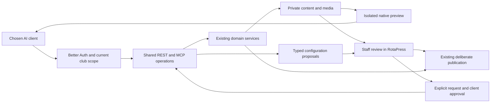

# AI workflow architecture

An assistant can discover the native content structure, prepare website or event
drafts, upload private images and inspect rendered previews. Staff review the
result before publishing. They can publish in administration or explicitly request
publication of the reviewed saved target through a separately granted tool.
Applying operational settings stays in administration. The model
runs in the chosen client; RotaPress supplies scoped tools and does not store
model-provider keys or run a background agent service.

## Components and responsibilities

| Component               | Responsibility                                                                             | Primary implementation                                |
| ----------------------- | ------------------------------------------------------------------------------------------ | ----------------------------------------------------- |
| Operation catalogue     | Shared REST/MCP routes, scopes, validated inputs, closed outputs and examples              | `src/integrations/automation/catalogue.ts`            |
| Native design discovery | CMS block schemas, supported contexts, templates and event layouts                         | `design_operations.ts`, `event_operations.ts`         |
| Connection access       | Better Auth credentials, current session and membership, scopes and transport availability | `AutomationAccess.ts`, `oauth/`                       |
| Event preparation       | Reviewed presets/copies, linked page and form drafts, stable retries                       | `event_operations.ts`, `EventTemplateService`         |
| Website management      | Private copies, languages, revision restoration and draft site settings                    | `WebsiteManagementService.ts`                         |
| Calendar management     | Versioned calendar/activity drafts, recurrence and page design                             | `calendar_operations.ts`, `CalendarService`           |
| Project stories         | Versioned volunteering/initiative drafts and explicitly requested publication              | `project_operations.ts`, `ProjectService`             |
| Requested publication   | Separate grants, exact saved targets and existing domain publication checks                | Shared operation catalogue and owning domain services |
| Media operations        | Validated private uploads, bounded pixel inspection and private metadata edits             | `media_operations.ts`, `MediaService`                 |
| Visual review           | Exact saved revisions rendered with native components in an isolated browser               | `WebsitePreviewService.ts`, `preview_*.ts`            |
| Settings proposals      | Typed immutable suggestions applied only through staff administration                      | `AutomationProposalService.ts`                        |
| Client prompts          | Instructions that compose existing tools into page, event and review workflows             | `workflow_prompts.ts`, `workflow_operations.ts`       |

Unqualified file names are under `src/integrations/automation`; the event and media
services remain in their owning feature modules. Adapters delegate to those
services rather than reproducing their authorization or persistence logic. See
[the extension contract](automation.md) when adding or changing an operation.

Clients compose these operations into a workflow. Responses supply saved versions,
readiness blockers and authenticated review links so the client can continue from
the resulting state. A completed tool call does not establish that an external
provider, notification, payment or public event is operational.

## Authority and publication

The server grants capabilities, not the prompt. Reload current identity,
membership, Google session policy, organization and object scope. OAuth consent
and manually issued connection keys delegate a real staff session; they cannot
create membership, change staff permissions or authorize actions after revocation.

Separate metadata from image pixels, read from draft write, and draft preparation
from publication and operational activation. Extra scopes require explicit consent from authorized
staff; discovery describes only the connection's granted operations. No image
becomes public merely because AI selected it. Completing a draft write never publishes it.

Publication tools require a separate grant, strict `confirmed: true`, and the exact
current saved revision/version. The client must act only on an explicit user
request for the target and should keep publication approval enabled. The server
enforces delegated identity, scope, saved state and existing publication checks;
it cannot establish what a human said in an external chat from that boolean.
Stale input or private-media/readiness blockers fail rather than widening the request.

Publish only the named target. Website settings, menu-only settings, calendar
details, activities and page design have separate publication operations. No tool
publishes dependencies or changes media visibility automatically. Calendar audiences
and normal subscriber notifications remain in force; publishing a form can make
it accept responses. Publishing event details does not publish its pages/forms or
enable registration. No unpublish or delete operation is added.

Keep consequential settings as typed review proposals where the underlying
feature has no draft model. Only the authenticated administration workflow may
apply a proposal, after current authorization and expected-state checks. A model's
`confirmed: true`, a prompt, or an MCP annotation is never human approval for
applying operational proposals. Publication grants do not authorize proposal application.

Participant identities, responses, member approvals, credentials, payments and
draw decisions remain outside content preparation. Native paid checkout, guest
invitation delivery and real paid draws are not implemented merely by adding MCP.
Use the existing event/provider workspace for those supported operational actions;
do not fabricate their completion in a tool receipt.

## Data flow

## OAuth and client boundaries

Use the maintained Better Auth OAuth provider with authorization-code/refresh
flows and exact client registration. Do not hand-roll a token issuer or accept
tokens minted for another service. Register clients through administration.
Anonymous dynamic registration and remote client-metadata fetching are disabled.

Publish resource and authorization-server metadata. Validate canonical resource,
redirect URI, PKCE, grant type and requested scopes. Display the client identity,
requested permissions, expiry and approved source websites before consent. Store
only library-managed hashed tokens; show credentials only when needed to create
the connection. Revocation, session expiry and current policy changes stop access.

Creating credentials, first consent and expanded grants/resource require recent
authentication. Repeated same or narrower approval uses the owner's current valid
staff session without another 15-minute age check. Better Auth can reuse remembered
consent for the same client, actions and resource; do not force a new consent
screen on each authorization.
Five-minute access tokens renew with rotating refresh tokens lasting up to seven
days while the originating session remains valid. Remove any independent eight-hour
consent age cutoff; session, grant and revocation checks remain mandatory.

When `scope` is omitted, Better Auth uses only that registered client's selected
actions. Preserve explicit narrower requests and reject empty or repeated scopes.
Initial discovery must not force a read-only scope or advertise all global actions
as required. New actions require a new registration and fresh consent for existing
connections; metadata cannot expand their stored grants.

Offer `offline_access` separately as the visible **Keep connected** choice, selected
by default even if a client specified actions without renewal. Declining it issues
no refresh authority. This choice must never widen application actions. The client
must retain each newly rotated refresh token and refresh access in the background.
AI-app connection prompts and per-tool approval are separate client behavior;
RotaPress renewal does not establish or suppress human approval of a publication.

Refresh requests may omit resource only because this server has one fixed MCP
resource. Initial authorization and code exchange require it explicitly; wrong or
repeated resources fail. The provider's ten-second same-client/scope/resource
retry grace can replay a lost refresh response, while normal token rotation,
current-session checks and revocation remain in force.

## Media and visual review

Keep large binary upload separate from ordinary JSON control requests. Both the
bounded MCP upload and original-image REST upload must call the same validated
media pipeline. Require stable upload request IDs; changed retries conflict.
Library listing does not imply permission to disclose private image bytes.

Preview tools accept a page ID, locale and expected revision, never an arbitrary
URL. Render only already-authorized native content using an isolated browser with
JavaScript disabled and all external requests blocked. Private assets require an
explicit pixel grant and current asset access; otherwise use placeholders. Preview tickets are short-lived,
single-use, instance-local and never appear in review URLs or model responses.

Bound browser concurrency, capture duration, viewport/slice height, file size and
request frequency. Recheck authorization after expensive rendering. A missing
browser or unsupported sandbox returns an unavailable result. See the
[preview runtime contract](../guides/automation-preview.md#runtime-and-isolation).
Publication review must still check facts, links, image rights and accessibility.

## Event preparation and retries

Reuse the atomic event-template coordinator for a new event and its pages/forms.
Use the current staff member as manager; model-supplied identity is not authority.
Provide safe starting presets and a reviewed copy of a permitted source event.
Use stable request IDs and the exact reviewed snapshot on retries. Never copy
participants, payment evidence, credentials or external provider state.

Draft page, form, package and prize edits keep their owning service's revision
checks. Readiness returns actionable content/configuration blockers and review
links rather than participant records. Operational proposals bind their exact
payload and expected state to the current organization/event and a real author;
staff can apply, reject or resolve a stale proposal in the existing workspace.

## Verification and growth

Every operation supplies an input/output schema, valid example, scope, current
authorization, safe error and concise model-facing description. Update generated
OpenAPI, prompts, coverage policy and source fingerprints together. Images are
returned as MCP image content, with metadata as structured output; never repeat
large base64 payloads in explanatory text.

Test expired/replayed OAuth codes, wrong audience/redirect/PKCE, changed membership,
revoked credentials, cross-event IDs, private bytes without scope, hostile image
payloads, preview SSRF/network isolation, stale revisions and conflicting retries.
For publication, test missing grants/confirmation, stale targets, domain blockers,
unchanged dependencies, calendar audience and normal notification behavior.
Exercise the local flow from connection through private event preparation and
preview with synthetic records and Mailpit. External ChatGPT, Claude or provider
integration needs a separate check against the configured HTTPS installation. See
[security testing](security-testing.md), [testing](testing.md) and the
[API/MCP contribution contract](automation.md).
