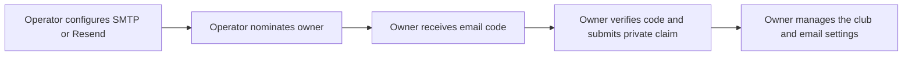

# Email before the first sign-in

Configure one server sender before opening owner setup. It delivers the first
owner's verification code, so it cannot depend on access to administration.
After installation, **Administration → Integrations → Email** shows this as
**Server sender**. The owner can keep it or select a tested admin connection.



For a hosted installation, start with [Host your club](hosting.md). Its installer
collects sender settings, nominates the owner and creates a private setup link.
For another container platform, use the [container contract](../development/hosting.md).
The examples below explain the sender requirements for either hosting path.

## 1. Configure the sender

Choose **one** provider below and replace its example sender and credentials with
your own. The hosting installer collects these settings; a container platform
stores them in protected server environment fields.

Credentials belong in the host's protected environment or secret manager.
Never put them in `NEXT_PUBLIC_*`, source control,
browser storage, URLs or a public setup form. Do not paste credentials into issues.
Use a sending credential limited to the intended domain when the provider supports it.

### Resend

```dotenv
EMAIL_PROVIDER=resend
EMAIL_REMOTE_DELIVERY_ENABLED=true
EMAIL_FROM_NAME=Your Club
EMAIL_FROM_ADDRESS=hello@your-club.example
RESEND_API_KEY=re_REPLACE_WITH_YOUR_SENDING_KEY
```

Resend requires an owned, verified sending domain. Follow its
[domain setup instructions](https://resend.com/docs/dashboard/domains/introduction)
before requesting a code. `EMAIL_FROM_ADDRESS` is the sender, not the owner's
sign-in address.

### SMTP

```dotenv
EMAIL_PROVIDER=smtp
EMAIL_REMOTE_DELIVERY_ENABLED=true
EMAIL_FROM_NAME=Your Club
EMAIL_FROM_ADDRESS=hello@your-club.example
SMTP_HOST=smtp.your-provider.example
SMTP_PORT=587
SMTP_USERNAME=REPLACE_WITH_YOUR_SMTP_USERNAME
SMTP_PASSWORD=REPLACE_WITH_YOUR_SMTP_PASSWORD
```

Use your provider's actual public hostname and authenticated sending account.
RotaPress requires STARTTLS on port 587 or TLS on port 465, validates certificates
and rejects private destinations, plaintext delivery and custom ports. See
[Nodemailer's SMTP contract](https://nodemailer.com/smtp).

Both providers accept optional `EMAIL_REPLY_TO`. A blank value omits it.
Restart the application and job runner after changing server settings. Enabling
delivery allows application emails to leave the server; use only an authorized
sender and intended recipients.

## 2. Nominate the owner

For the guided Docker installation, the installer asks for the owner's email and
saves a private setup link. On another container platform, configure
`ROTAPRESS_OWNER_EMAIL` and `ROTAPRESS_SETUP_CLAIM` as described in the
[container contract](../development/hosting.md#protected-settings).

For a local source installation, first generate local infrastructure and secrets:

```sh
node scripts/pnpm.mjs setup
```

Add the chosen provider settings to `.env.local`, then nominate the owner and
start the local application:

```sh
node scripts/pnpm.mjs setup --owner-email your-real-address@example.org
node scripts/pnpm.mjs dev
```

Local setup itself does not send email. The nomination command saves a one-hour installation
claim in `.local/setup-claim.txt` and nomination details in `.local/setup-info.json`.

Use an inbox the owner controls and share the setup link or local claim through a
private channel. Keep these files out of Git and shared screenshots. The web
process cannot issue a claim or change its nominated identity.

Before the installation is claimed, delivery is limited to the nominated email
and requires an unexpired claim. No arbitrary recipient or mail credentials can
be supplied through the setup screen.

## 3. Verify and claim the club

Open the private hosted setup link, or `/setup` for a local source installation.
If the sender is absent or disabled, setup explains what the
server administrator must configure and does not offer a broken sign-in action.
Configured means the settings are present, not that a provider has accepted a message.

Request a code for the nominated owner, read it in that owner's real inbox, then
verify it. Better Auth checks the expiring code and creates the session. Complete
the club details to become owner. Hosted links carry the installation claim;
local source setup asks you to supply the separate claim. Neither the claim nor
sender configuration bypasses email verification.

If delivery fails, check the sender/domain status, provider credential, delivery
flag and provider logs. RotaPress returns a safe error without provider details.
There is no automatic fallback to another provider or development mailbox.

For an expired hosted link, run `node scripts/host.mjs link` or replace the pending
claim using your container platform's protected settings. Restarting with the same
hosted claim does not renew its expiry. For local source setup, rerun the setup
command; an unexpired local claim and nomination are preserved, while explicitly
nominating a different email issues a replacement. Completed installations cannot
be claimed again.

## 4. Manage email after installation

The server sender remains in use until the owner selects another connection in
[Email settings](email.md). Admin connections are encrypted in the database;
server credentials remain in the protected server environment. The server
connection appears automatically, including when delivery is disabled, labeled
**Managed by server environment**. Its read-only details reflect the selected
provider, sender, reply-to and SMTP settings after a restart. API keys and
passwords show only **Configured**, never their values. Selecting an admin
connection leaves the environment settings intact and marks the server sender
as not selected.

To change an admin connection, save it, send a test to your signed-in account,
check your inbox, then select it. To return to the server sender, choose **Test
and use server sender**: a failed test leaves the current connection selected.
Changing delivery requires recent owner authentication.

Keep a working owner session while changing the sender. If the active admin
provider fails, changing the server environment alone does not override it.
Repair that provider or switch through the existing authorized session. If all
sessions have expired, repair the selected sender before requesting another code.
The local `recover:owner` command is restricted to development identities and does
not recover a hosted email outage. Never reopen ownership setup as a recovery
shortcut.

## Development email

`EMAIL_PROVIDER=disabled` is the default. Production mode is the default when
`ROTAPRESS_ENVIRONMENT` is absent. Production rejects the development provider;
it never connects to a local capture mailbox as an email fallback.

Mailpit is an opt-in development service under Compose's `development` profile.
It captures synthetic test messages locally and cannot verify delivery to a real
inbox. It must not run in a production deployment. Contributor setup is
documented separately in [local development](../development/local-development.md).
